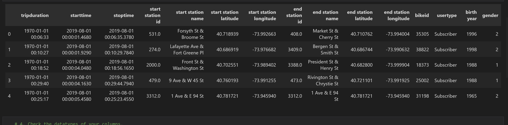
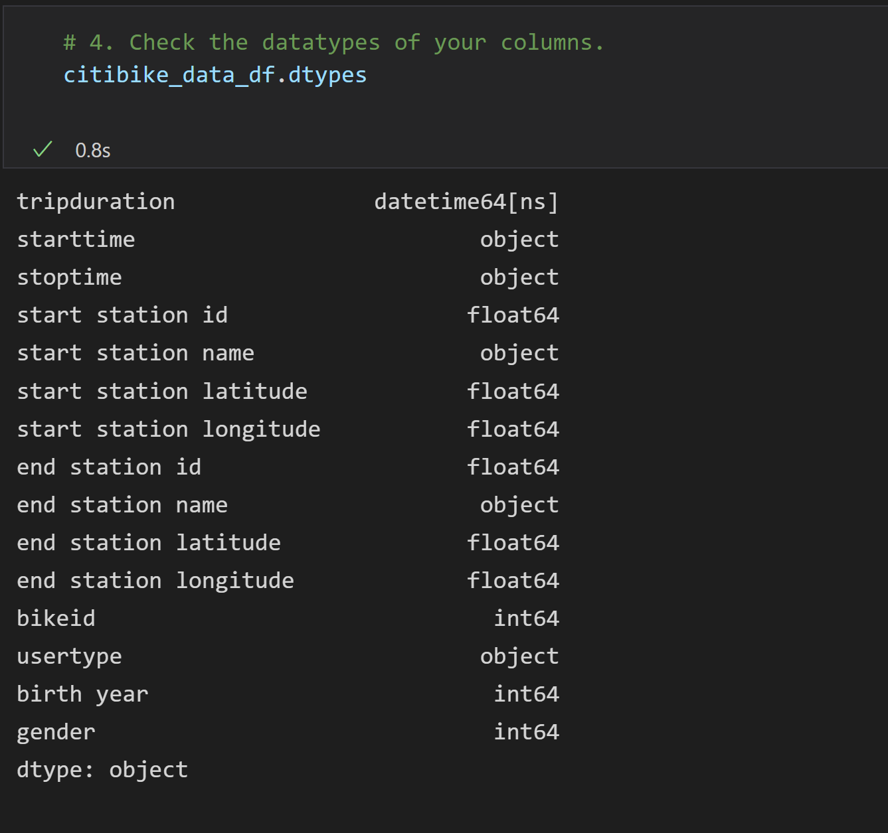

# Citibike - A bikesharing company in New York City.

## Reviewed various Citibike metrics from August 2019 for feasability in Des Moines, Iowa.

## 3 Deliverables
###     Deliverable 1: Change Trip Duration to Datatime Format - see NYC_Citibike_Challenge.ipynb file & screen captures.
###     Deliverable 2: See link "https://public.tableau.com/app/profile/stephen.levy/viz/Mod_14-challenge/CitibikeStory?publish=yes"
###     Deliverable 3: "Citibank Story" (see above link).

    1. The Dataframe/CSV file produced for Deliverable 1 and used as input for Deliverable 2 VIZs is called: "201908-Citibike-tripdata_2" 
       The google link to this file is: "https://drive.google.com/file/d/1h0YWCumY3tcaOSDn65y_eWN1M1zpauJ2/view?usp=sharing"
       The original input file can be downloaded from Module 14. Note that these 2 data files were too big to push to GitHub.

    2. See ViZs in "https://public.tableau.com/app/profile/stephen.levy/viz/Mod_14-challenge/CitibikeStory?publish=yes" for Deliverable 2.
       The first 5 plots in the attached Tableau link were produced for Deliverable 2. The sheets are called: : "Checkout Times for Users",
       "Checkout Times by Gender", "Trips by Weekday per Hour", "Trips by Gender (Weekday per Hour)", & "User Trips Gender by Weekday." 

    3. See "Citibike Story" tab in "https://public.tableau.com/app/profile/stephen.levy/viz/Mod_14-challenge/CitibikeStory?publish=yes" for Deliverable 3.
       Also produced 4 Dashboards to create "Citibike Story." The are called "Dashboard Summary", "Dashboard locations", "Dashboard Pie Charts", 
       and "Dashboard-Checkout-times."

Conclusions for "Citibike Story" are:

1. The Subscriber-Gender caption shows that Weekday Male Subcribers make up the majority of Citibike Users. Weekend counts are lower.

2. The Pie-Charts caption shows that Male Subscribers make up the majority of Citibike Users.

3. The 2 captions for Hours of Use - Gender show that Males make up the majority of Citibike Users from 7-9 am. & 5-7 pm weekdays. Weekend counts are lower.

4. The Start/End Locations captions show very similar maps, which suggest that the Pick-up & Drop-off locations are the same.

5. The Checkout Times caption shows average checkout times of 5 mins for all users, 5 mins for males users, and 6 mins for female users. This observation should be addressed.

6. The high weekday usage from 7-9 am. and 5-7 pm. by Male Subscibers indicates that Citibike serves primarily as a work tranportation convenience for men in NYC - particularly in Manhattan during August 2019.

7. The remaining 11 months should be analyzed to determine annual user counts. NYC has many months of cold, rainy, & snowy weather, which are not conducive to bicycle transport. The Des Moines weather could present similar challenges for many months of the year.

## SCREENSHOTS

